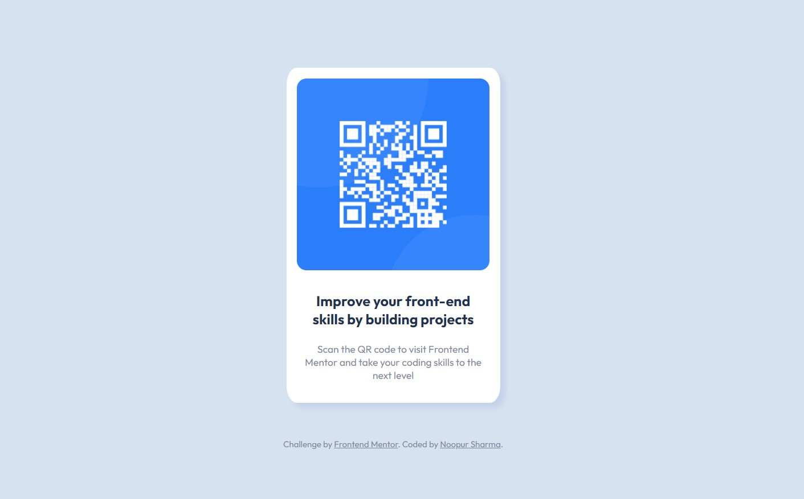

# QR code component

This is a solution to the [QR code component challenge on Frontend Mentor](https://www.frontendmentor.io/challenges/qr-code-component-iux_sIO_H).
## Table of contents

- [Overview](#overview)
  - [Screenshot](#screenshot)
  - [Links](#links)
- [Continued development](#continued-development)
- [Useful resources](#useful-resources)
- [Author](#author)

## Overview

### Screenshot

### Links

- [Solution URL](https://github.com/noopur0210/qr-code-component)
- [Live Site URL](https://noopur0210.github.io/qr-code-component/)

## Continued development

With this project and the future ones I'll try to get better with more CSS properties and responsive workflows.

## Useful resources

- [Angela Yu's Web-dev bootcamp](https://www.udemy.com/course/the-complete-web-development-bootcamp/) - A great course to help you learn all the concepts of fullstack development.
- [Frontend Mentor](https://www.frontendmentor.io/) - Great for practice challenges on frontend development.
 - [Traversy Media YouTube channel](https://www.youtube.com/c/TraversyMedia) - Learn all concepts of Web Development for free with great projects.

## Author

- GitHub - [noopur0210](https://github.com/noopur0210)
- Twitter - [@noopurstwt](https://twitter.com/noopurstwt)
- LinkedIn - [Noopur Sharma](https://www.linkedin.com/in/noopur-sharma/)
- Frontend Mentor - [@noopur0210](https://www.frontendmentor.io/profile/noopur0210)
- Blog - [Noopur Sharma](https://dev.to/noopur0210)
